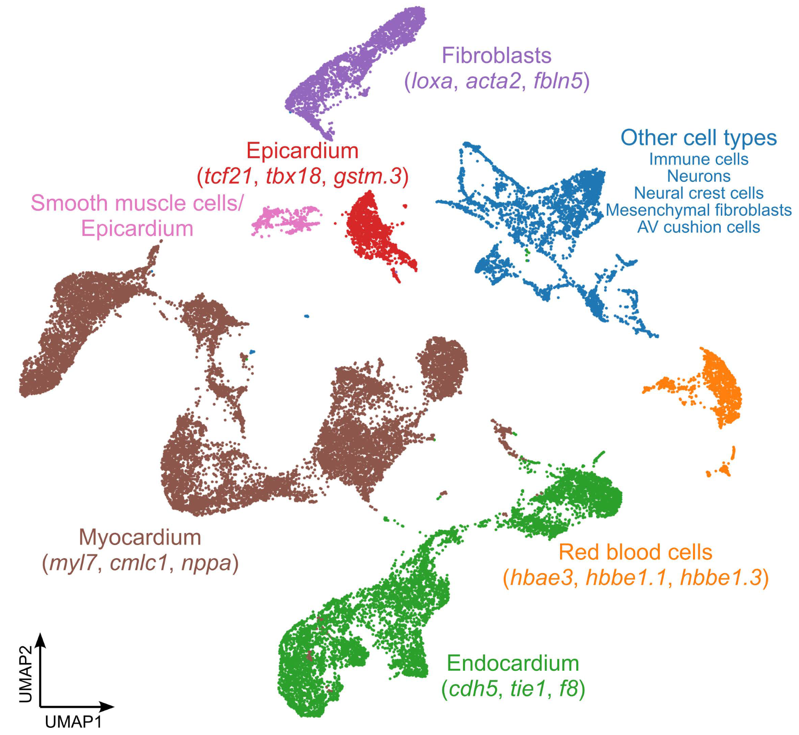

This repository contains the code used to analyze the Danioheart atlas. The Danioheart atlas is intended to serve as a valuable resource for the scientific community that enhances the understanding of the mechanisms underlying heart development.

You can access the dataset through the link: [Danioheart Atlas V1](https://bioinformatics-cluster2.mpi-bn.mpg.de/mampok-cluster-bn/danioheart-atlas-v1/cellxgene-fix/)

For re-running the analysis and using the notebooks provided, you need the python package [SC-Framework](https://github.com/loosolab/SC-Framework/) which provides the tools and functionality that we used for the analysis. A detailed documentation can be found here: [SC-Framework-Manual](https://loosolab.pages.gwdg.de/software/sc_framework/).
